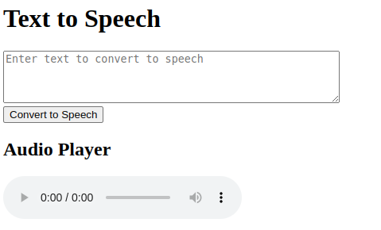

# AwsPollyTextToVoice :pencil: :arrow_right: :speaker:

Turns text into audio using Amazon Polly

## How does it works :question:

To go to the webpage [click here](https://textvoicepageholder.s3.amazonaws.com/index.html)

Write in the textbox and then click "Convert to Speech". If everything is ok, the audio converted from the text that you provided will be played automatically.

## AWS Services Used :cloud: :construction_worker:

1. API Gateway
2. Lambda
3. Polly
4. S3 Bucket
